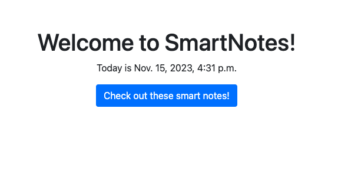

# Smart Notes Application
## Description
This is a simple note taking application that allows the user to create, read, update, and delete notes. The application uses an express backend and saves and retrieves note data from a JSON file.

## Table of Contents
* [Installation](#installation)
* [Usage](#usage)
* [License](#license)
* [Questions](#questions)
* [Contributing](#contributing)
* [Tests](#tests)
* [Credits](#credits)
* [Contact](#contact)
* [Links](#links)
* [Screenshots](#screenshots)
* [Video](#video)
* [Badges](#badges)
* [Features](#features)
* [How to Contribute](#how-to-contribute)

### Installation
To install dependencies, run the following:
- clone the repository to your local machine 
- Ensure that you have python3 installed on your machine
- Install the dependencies by running the following command: pip install -r requirements.txt

### Usage
- Run the following command at the root of your project
- Migration: ```python3 manage.py makemigrations```
- Migrate: ```python3 manage.py migrate```
  ```python3 manage.py runserver```
- Navigate to your browser and input the following: http://localhost:8000/
- sign up for an account
- log in to your account
- create a note
- view your notes
- edit your notes
- delete your notes
- log out of your account
- log back in to your account
- view your notes

### License
This project is licensed under the MIT license.

### Questions


If you have any questions about the repo, open an issue or contact [bpolo15](
https://api.github.com/Dan) directly at null.

### Contributing
[Contributor Covenant](https://www.contributor-covenant.org/)
### Tests
To run tests, run the following:
- ```python3 manage.py test```
- ```python3 manage.py test --pattern="tests_*.py"```

### Credits
-

### Contact
Find me on GitHub: [DanSam5k](https://github.com/DanSam5K)
Find me on LinkedIn: [DanSam5k](https://www.linkedin.com/in/dansamuel/)

### Links
The current endpoints are:
- http://localhost:8000/home/
- 

### Screenshots


### Video
[

### Badges


### Features
-

### How to Contribute
To contribute to this project, fork the repository, make changes, and push those changes to the repo.
